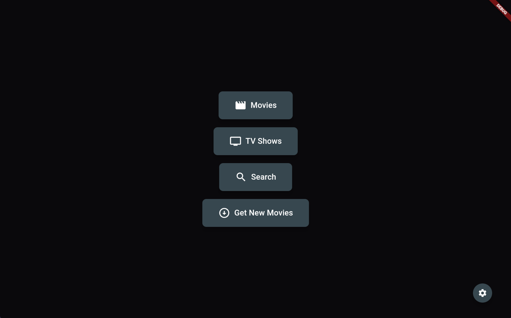
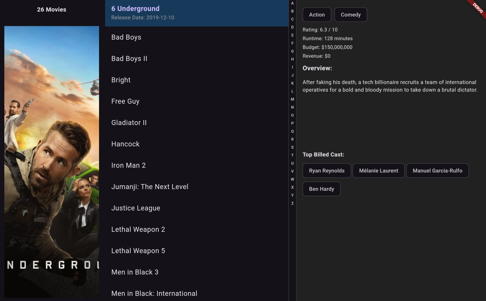
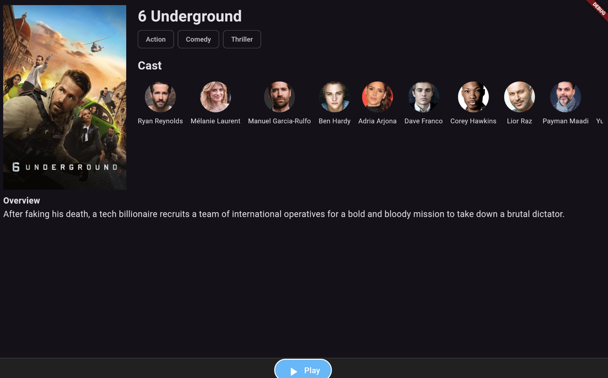
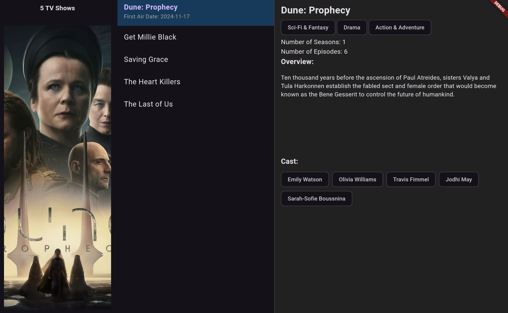
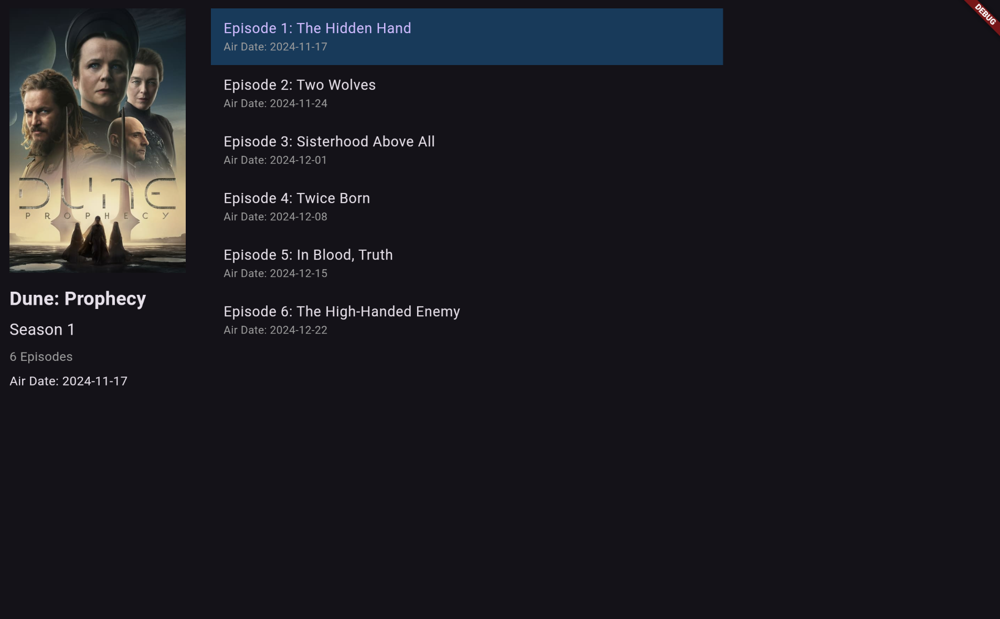

# AndroidTV Debrid Player

This is a small project i been working on and decided to open source it to hopefully get some better devs to improve it. right now it plays streams from premiumize that it fetches from orionoid. i modeled the ui after kodi skins list views. though maybe someone will take this base and improve it and add more screen view options like a poster view.

# Current Features

Fetches a simkl "plan to watch" watchlist. Uses that watchlist to fetch all the needed metadata from TMDB and stores it in a folder called "Player_Files" on the root of the internal storage that way you can back it up at anytime, NOTE that doing this makes it so you MUST give the app storage permissions.

Authenticates using Orion's api, uses orion to fetch links, sends those links to vlc installed on your device to stream them.

The Movies screen and TVShows screen are done in a list view that shows posters,information and title etc. you can mark episodes or movies as "watched" that way you can track what has been viewed. The movies screen also contains a quick navigation bar on the side for quickly jumping to letters in your library.

There is a search function to search the library.

A Settings screen to change the results returned from orion and change the sort method of the movies screen. NOTE changing the sort method away from A-Z will result in the quick navigation bar not working.
## Supported platforms

Currently I only tested it on a "onn. Google TV 4K Pro" but it should work on pretty much all androidTV devices. 

Considering this app is using flutter it theoretically can support IOS, WEB, Android, and windows apps. though right now it has hard coded paths for android so it would need to be modified to use other paths on other devices, after that i dont see why it wont work on tablets,phones, PC's etc.

## Building

Compiling this is simple, just setup android studio and flutter.

Compile with the command "flutter build apk"

## Setup

1. Before running the app make sure you give the app storage permissions
2. Make sure you have your TMDB, Orion, and Simkl api keys in the "Player_Files/apikeys" directory.

### so your directory should look like this:

Player_Files/apikeys/orion_keys.txt

Player_Files/apikeys/simkle_keys.txt

Player_Files/apikeys/mdb_keys.txt

### inside each file you will place your api key for the respective service.
for orion you will add this:

orion_api_key = YOUR_API_KEY

for simkle add this:

simkl_client_Id = YOUR_API_KEY

for TMDB add this:

tmdb_api_key = YOUR_API_KEY

## Contributing

Contributions are always welcome!

I am open sourcing this to hopefully get some people to improve it, add new features etc. 

I am very new to this so the code i know is shoddy and has alot of improvements that can be made. You will find unused, duplicate and even uneeded code. I been working on this and added/removed/changed things so much that I gaurentee I left remnants

### Some things I think would be highly welcomed if someone was looking to add new features:

Integrate VLC directly that way we can track watch progress.

Actor searching: and ability to select an actor from the movie details screen to find all movies by them.

More view options such as poster view.

More debrid service options

Option to use Trakt instead of Simkl for fetching lists.

# Here is some Screenshots though note these screenshots were takin using the android studio tablet emulator thus the scaling for the screens isnt right from what you will see when running on a AndroidTV.

UI Screenshots:

